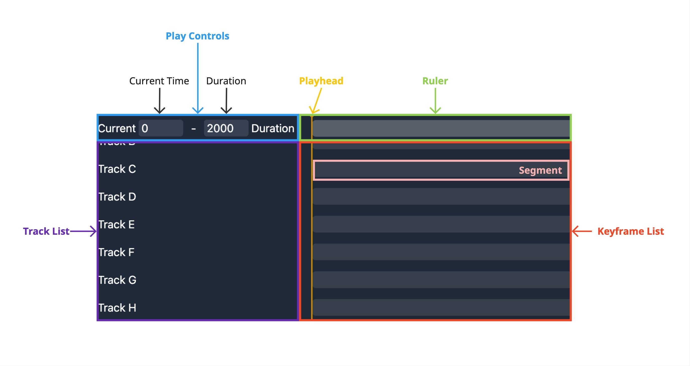

# Phase Timeline Challenge

## Overview

Implement interactive features for a Timeline component. We will provide a basic Timeline component scaffold, and your task is to implement the functionality that meets the user behavior requirements outlined below.

## Glossary

- **Timeline**: The main component that visually represents the duration of a sequence of events or changes over time.
- **Playhead**: The visual indicator that shows the current time position on the Timeline.
- **Current Time**: The specific time point indicated by the Playhead's position.
- **Duration**: The total length of time represented by the Timeline.
- **Ruler**: The component showing time measurements and increments along the Timeline.
- **Track**: A horizontal lane on the Timeline that can contain multiple Keyframes, often used to group related events or changes.
- **Track List**: The component that displays and manages multiple Tracks.
- **Keyframe**: A marked point on the Timeline representing a significant event, change, or state.
- **Keyframe List**: The component that shows the Keyframes across all Tracks, synchronized with the Ruler.
- **Segment**: The visual representation of the Timeline's duration in the Keyframe List.

## User Behavior Requirements

### 1. Number Input Field

#### Interface

| Prop       | Type               | Description                                      |
| ---------- | ------------------ | ------------------------------------------------ |
| `value`    | `number`           | The current value of the input field             |
| `onChange` | `(number) => void` | The callback to be called when the value changes |

#### Behavior

https://github.com/user-attachments/assets/8dd5ef2b-6b57-43dc-91b3-0d322d148781

- [ ] #1-1: The displayed value updates immediately while typing, but `onChange` is not triggered until input is confirmed
- [ ] #1-2: Clicking outside the input field removes focus and changes the value
- [ ] #1-3: Clicking on the native step buttons immediately changes the value
- [ ] #1-4: Pressing up arrow or down arrow keys immediately changes the value
- [ ] #1-5: Entire text is selected when the input field gains focus
- [ ] #1-6: Entire text is selected after using the native step buttons
- [ ] #1-7: Entire text is selected after using the up arrow or down arrow keys
- [ ] #1-8: Pressing Enter confirms the new value and removes focus
- [ ] #1-9: Pressing Escape reverts to the original value and removes focus
- [ ] #1-10: Leading zeros are automatically removed
- [ ] #1-11: Negative values are automatically adjusted to the minimum allowed value
- [ ] #1-12: Decimal values are automatically rounded to the nearest integer
- [ ] #1-13: Invalid inputs (non-numeric) revert to the previous valid value

### 2. Play Controls Behavior

https://github.com/user-attachments/assets/9a669854-e0c5-4950-8364-10fe0b40d16b

- [ ] #2-1: Current Time is always between `0ms` and the Duration
- [ ] #2-2: Current Time adjusts if it exceeds the newly set Duration
- [ ] #2-3: Duration is always between `100ms` and `6000ms`
- [ ] #2-4: Current Time and Duration are always multiples of `10ms`
- [ ] #2-5: Current Time and Duration are always positive integers
- [ ] #2-6: Playhead position updates only after specific actions on Current Time input (losing focus, pressing Enter, using arrow keys, or clicking up/down buttons)

### 3. Ruler Behavior

https://github.com/user-attachments/assets/42190ade-f708-45a1-8168-2be779c66390

- [ ] #3-1: Clicking or dragging on the Ruler updates the Current Time and Playhead position
- [ ] #3-2: Horizontal scrolling of the Ruler is synchronized with the Keyframe List
- [ ] #3-3: Ruler length visually represents the total Duration (`1ms = 1px`)
- [ ] #3-4: Ruler length updates only after specific actions on Duration input (losing focus, pressing Enter, using arrow keys, or clicking up/down buttons)

### 4. Track List Behavior

https://github.com/user-attachments/assets/94b5e2c8-ef32-488e-97e4-d53036bbf2f7

- [ ] #4-1: Vertical scrolling of the Track List is synchronized with the Keyframe List

### 5. Keyframe List Behavior

https://github.com/user-attachments/assets/99826161-f821-4e4d-b9a8-b59c16d9894e

- [ ] #5-1: Vertical scrolling is synchronized with the Track List
- [ ] #5-2: Horizontal scrolling is synchronized with the Ruler
- [ ] #5-3: Segment length visually represents the total Duration (`1ms = 1px`)
- [ ] #5-4: Segment length updates only after specific actions on Duration input (losing focus, pressing Enter, using arrow keys, or clicking up/down buttons)

### 6. Playhead Behavior

https://github.com/user-attachments/assets/3940cd0d-dd9d-4331-9172-592462ad65d3

- [ ] #6-1: Playhead moves in sync with the Ruler and Keyframe List during horizontal scrolling
- [ ] #6-2: Playhead maintains its relative position during horizontal scrolling
- [ ] #6-3: Playhead is visible only when within the Timeline's visible area, using the `hidden` attribute when completely out of view

## Implementation Guidelines

- Implement the required behaviors in the appropriate child components of the provided Timeline
- Write comprehensive tests to ensure that the implementation meets the user behavior requirements, including edge cases
- Consider performance implications, such as minimizing unnecessary re-renders
- Pay attention to user experience and interface design
- Write clean, well-documented, and maintainable code

## Important Notes

⚠️ **Warning**: Do not change any `data-testid` attribute names in the provided components. These are used for automated assessment of your assignment. Modifying these names may result in failing the assessment criteria.

## Submission

- Share your code repository (GitHub or GitLab) containing the implemented solution
- Ensure the repository includes all necessary code, tests, and documentation
- Provide any additional setup or running instructions in the repository's README file
- Be prepared to answer follow-up questions about your implementation if requested

Good luck with the Phase Timeline Challenge!
